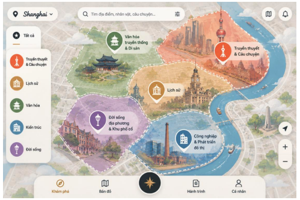
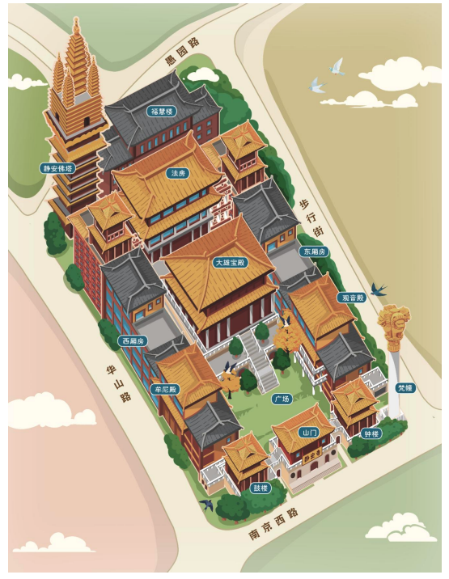
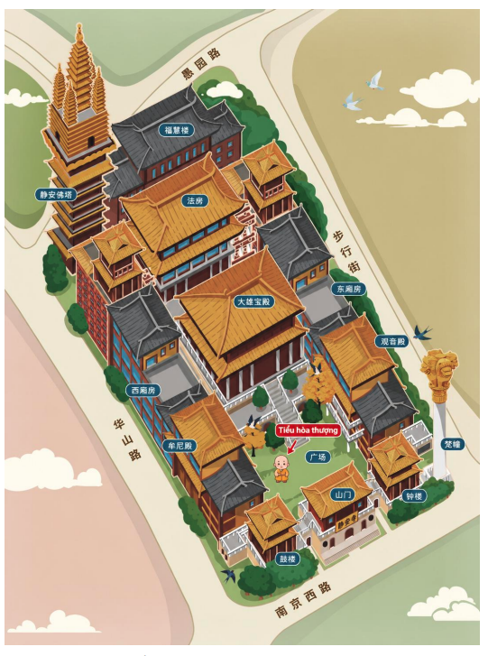
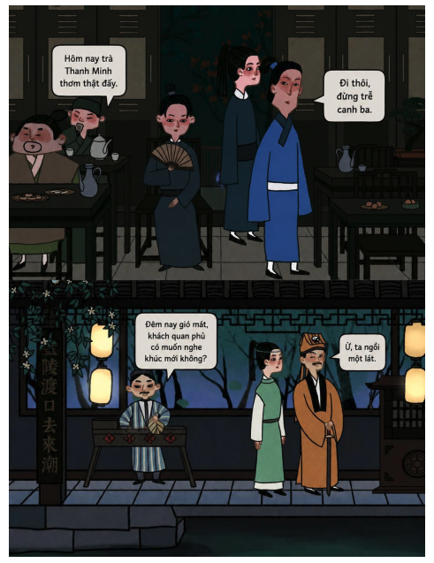

## **05. CONTENT ARCHITECTURE** 

## **1. Vai trò của nội dung trong BonVoye** 

Nếu bản đồ là khung xương của BonVoye, thì nội dung chính là phần tạo nên giá trị của sản phẩm. 

Người dùng có thể tìm thấy rất nhiều ứng dụng cung cấp bản đồ, GPS hoặc công cụ lập kế hoạch hành trình. Tuy nhiên, điều khiến họ lựa chọn tiếp tục sử dụng BonVoye nằm ở những câu chuyện, kiến thức và trải nghiệm mà họ khám phá được trong suốt hành trình. 

BonVoye không xem nội dung là phần bổ sung cho sản phẩm. Ngược lại, toàn bộ sản phẩm được xây dựng xoay quanh nội dung. Bản đồ, Story Map, NPC hay các tính năng tương tác đều được tạo ra nhằm giúp người dùng tiếp cận nội dung một cách trực quan và hấp dẫn hơn. 

## **2. Cấu trúc nội dung** 

Toàn bộ nội dung trong BonVoye được tổ chức theo một cấu trúc thống nhất: 

_**Country → City → Topic → POI → NPC → Story → Hidden Threads**_ 

Cấu trúc này giúp nội dung có thể mở rộng từ một vài địa điểm lên hàng nghìn địa điểm mà vẫn duy trì được sự nhất quán trong trải nghiệm người dùng. 

Tóm tắt vai trò từng cấp trước khi đi vào chi tiết: 

- **Country** — bối cảnh văn hóa, lịch sử, địa lý lớn nhất; gom nhiều City. 

- **City** — "thế giới khám phá" độc lập, gắn với một khu vực địa lý cụ thể; gom nhiều Topic. 

- **Topic** — tuyến chủ đề khám phá bên trong một City. 

- **POI** — một địa điểm cụ thể ngoài thực tế. 

- **NPC** — nhân vật kể chuyện gắn với một POI. 

- **Story** — đơn vị nội dung nhỏ nhất, gắn với một NPC. 

- **Hidden Threads** — lớp nội dung mở rộng, mở ra sau khi hoàn thành Story. 

## **3. Country** 

Country là đơn vị tổ chức nội dung lớn nhất trong BonVoye, đại diện cho bối cảnh văn hóa, lịch sử và địa lý chung của một quốc gia. 

Country không trực tiếp chứa POI hay NPC. Vai trò của nó là làm "bối cảnh nền" giúp nội dung của các City bên trong có sự nhất quán về ngôn ngữ, giai đoạn lịch sử, đặc trưng văn hóa vùng miền và cách kể chuyện phù hợp với quốc gia đó. Mỗi Country có thể chứa nhiều City. 

Khi BonVoye mở rộng sang một quốc gia mới, hệ thống cần xác lập bối cảnh Country này trước, làm nền tảng cho toàn bộ City được xây dựng bên trong. 

## **4. City** 

City là đơn vị "thế giới khám phá" độc lập trong BonVoye — nơi người dùng thực sự trải nghiệm bản đồ, Topic và các câu chuyện. 

Mỗi City gắn với một khu vực địa lý cụ thể, thường là một thành phố hoặc trung tâm đô thị, và chứa toàn bộ hệ thống Topic, POI, NPC, Story, Hidden Threads thuộc về nó. Đây chính là cấp độ mà các mục 5 → 9 tiếp theo (Topic, POI, NPC, Story, Hidden Threads) được xây dựng bên trong. 

Người dùng chọn một City để bắt đầu hành trình, sau đó mới tiếp tục khám phá theo Topic bên trong thành phố đó. 

## **5. Topic** 

Topic là đơn vị tổ chức nội dung lớn nhất bên trong một City. 

Thay vì để người dùng tiếp cận hàng trăm địa điểm cùng lúc, BonVoye chia City thành các chủ đề khám phá khác nhau như lịch sử, văn hóa, kiến trúc, đời sống địa phương hoặc truyền thuyết đô thị. 

Mỗi Topic đại diện cho một góc nhìn riêng về City và được xây dựng như một tuyến khám phá hoàn chỉnh với hệ thống POI, NPC và câu chuyện riêng. 

## **6. POI** 

POI là đơn vị trải nghiệm cơ bản của BonVoye. 

Mỗi POI đại diện cho một địa điểm cụ thể ngoài thực tế và cần có ít nhất một câu chuyện đáng để kể. Một POI không chỉ tồn tại như một điểm dừng trên bản đồ, mà đóng vai trò kết nối người dùng với lịch sử, văn hóa, con người và những sự kiện gắn với địa điểm đó. 

## **7. NPC** 

NPC là đơn vị kể chuyện cơ bản trong BonVoye. 

Mỗi NPC luôn gắn với một địa điểm cụ thể và chịu trách nhiệm kể một phần nội dung nhất định. NPC có thể là nhân vật lịch sử, nhân vật văn học, nhân vật điện ảnh, nghề nghiệp đặc trưng, truyền thuyết địa phương hoặc hình tượng được nhân hóa từ chính địa điểm đó. 

Mỗi NPC cần trả lời ba câu hỏi: 

- Tôi là ai? 

- Vì sao tôi xuất hiện ở đây? 

- Tôi kể câu chuyện gì? 

## **8. Story** 

Story là đơn vị nội dung nhỏ nhất trong BonVoye. 

Mỗi Story được gắn với một NPC và một vị trí cụ thể trên Story Map. Thay vì liệt kê thông tin hoặc dữ kiện lịch sử, Story tập trung vào việc kể lại một nhân vật, một sự kiện hoặc một góc nhìn cụ thể liên quan tới địa điểm. 

Nhiều Story kết hợp với nhau sẽ tạo thành bức tranh hoàn chỉnh về một POI. 

## **9. Hidden Threads** 

Không phải mọi nội dung đều cần xuất hiện trong hành trình chính. 

Hidden Threads là lớp nội dung mở rộng dành cho những người muốn tìm hiểu sâu hơn sau khi hoàn thành các Story cốt lõi. Nội dung có thể bao gồm nhân vật liên quan, sự kiện liên quan, địa điểm liên quan, truyền thuyết đô thị, vụ án có thật hoặc những câu chuyện ít được biết đến. 

Thông qua Hidden Threads, mỗi địa điểm không còn là một câu chuyện đơn lẻ mà trở thành điểm khởi đầu của một mạng lưới nội dung lớn hơn. 

## **10. Content Routes** 

Hiện tại, BonVoye được xây dựng dựa trên năm nhóm tuyến nội dung chính, áp dụng trong phạm vi một City: 

- Tuyến cảnh điểm. 

- Tuyến lịch sử. 

- Tuyến truyền thuyết đô thị và dân gian. 

- Tuyến vụ án có thật. 

- Tuyến văn hóa và đời sống. 

Một địa điểm có thể đồng thời xuất hiện trong nhiều tuyến khác nhau nếu được tiếp cận dưới những góc nhìn khác nhau. 

Cùng một dạng tuyến (ví dụ tuyến lịch sử) có thể lặp lại ở nhiều City khác nhau, nhưng nội dung cụ thể của tuyến đó luôn gắn với City — và gián tiếp với Country — mà nó thuộc về. 

## **11. Content Principles** 

Toàn bộ nội dung trong BonVoye được xây dựng dựa trên sáu nguyên tắc: 

- Nội dung của một City phải nhất quán với bối cảnh văn hóa, lịch sử của Country mà nó thuộc về, đồng thời giữ được bản sắc riêng của thành phố đó. 

- Mọi nội dung đều phải gắn với địa điểm thực tế. 

- Mỗi địa điểm cần được tiếp cận từ nhiều góc nhìn khác nhau. 

- Nội dung giữa các NPC phải bổ sung cho nhau thay vì lặp lại. 

- Ưu tiên storytelling hơn thuyết minh. 

- Nội dung được phân tầng từ cơ bản đến chuyên sâu để phù hợp với nhiều nhóm người dùng. 

## **12. Content Scalability** 

BonVoye được thiết kế để mở rộng lâu dài, theo hai chiều: 

- **Mở rộng City trong một Country hiện có**: chỉ cần xây dựng thêm Topic, POI, NPC và Story tương ứng cho City mới, tái sử dụng bối cảnh văn hóa và lịch sử đã có ở cấp Country, mà không làm thay đổi cấu trúc hiện có. 

- **Mở rộng sang một Country mới**: cần xác lập bối cảnh Country trước (theo mục 3), rồi mới xây dựng các City và toàn bộ nội dung chi tiết bên trong từng City đó. 

Nhờ cấu trúc thống nhất theo bảy cấp Country → City → Topic → POI → NPC → Story → Hidden Threads, BonVoye có thể mở rộng từ một vài tuyến khám phá trong một thành phố thành một thư viện nội dung về lịch sử, văn hóa và ký ức đô thị của nhiều thành phố, thậm chí nhiều quốc gia khác nhau. 
